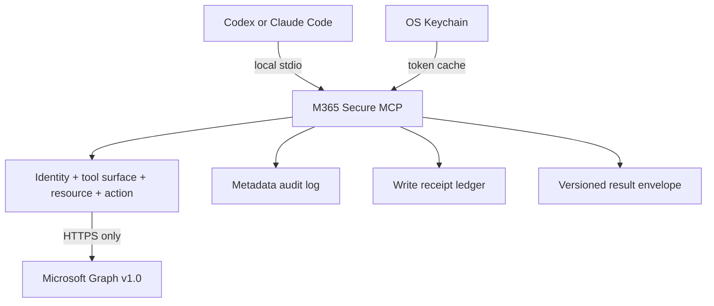

<p align="center">
  
</p>

[](https://github.com/bugroo/m365-secure-mcp/actions/workflows/ci.yml)
[](LICENSE)

A local-first MCP server that gives Codex, Claude Code, and compatible clients
controlled access to Microsoft 365 through fixed, reviewable tools.

| Fixed contracts | Read profile | Opt-in writes | Delete tools | Modules |
|---:|---:|---:|---:|---:|
| 91 | 75 max | 15 | 0 | 23 |

[Installation](#installation) | [Security model](#security-model) |
[Evidence](#evidence-contract) | [Diagnostics](#diagnose-before-serving) |
[Capabilities](#capabilities) | [Planner details](#planner-task-details) |
[Private policy](#private-policy-and-resource-discovery) |
[Tool catalog](docs/TOOL_CATALOG.md) |
[Entra setup](docs/ENTRA_SETUP.md)

## What this server is

`m365-secure-mcp` is not a generic Microsoft Graph proxy. The model cannot
choose a URL, HTTP method, permission scope, or request header.

The operator starts with a broad catalog, then reduces each deployment by
identity, module, tool, resource, and action. Unknown or out-of-policy
configuration fails before the server starts.



## Installation

Requirements: Python 3.11+, [`uv`](https://docs.astral.sh/uv/), and a
single-tenant Microsoft Entra public-client registration.

```bash
git clone https://github.com/bugroo/m365-secure-mcp.git
cd m365-secure-mcp
uv sync --frozen --python python3.13
```

The committed `uv.lock` pins the resolved dependency graph. This project has no
Node.js runtime, postinstall script, or client secret.

### Configure and seal the smallest profile

```bash
export M365_TENANT_ID="<tenant-guid>"
export M365_CLIENT_ID="<public-application-guid>"
export M365_ALLOWED_USER_OBJECT_IDS="<user-object-guid>"
export M365_ALLOWED_UPN_DOMAINS="example.com"

uv run m365-secure-mcp --check-config
uv run m365-secure-mcp --explain-permissions
uv run m365-secure-mcp --doctor
uv run m365-secure-mcp --list-tools
uv run m365-secure-mcp --export-policy \
  "$HOME/Library/Application Support/m365-secure-mcp/read-policy.json"
uv run m365-secure-mcp --policy-file \
  "$HOME/Library/Application Support/m365-secure-mcp/read-policy.json"
```

The export is a new owner-only `0600` file inside an owner-only `0700`
directory. Existing paths, symlinks, unknown settings, and broad permissions
are rejected. The private policy contains tenant/resource identifiers but no
token or client secret; keep it out of Git and client configuration.

The default configuration exposes only:

```text
m365_get_security_posture
m365_get_my_profile
```

Enable domains and individual tools deliberately:

```bash
export M365_MODULES="profile,mail,calendar,files"
export M365_ENABLED_TOOLS="m365_search_mail,m365_list_calendar,m365_search_files"
```

## Connect a client

<details>
<summary><strong>Codex</strong></summary>

Merge [examples/codex-read.toml](examples/codex-read.toml) into a trusted
project's `.codex/config.toml`, point it at the private policy file, and keep:

```toml
default_tools_approval_mode = "prompt"
```

Do not combine a write profile with automatic tool approval.

</details>

<details>
<summary><strong>Claude Code</strong></summary>

Use [examples/claude-code-read.mcp.json](examples/claude-code-read.mcp.json) as
the local stdio definition. It references the private policy by path; tenant
and user identifiers stay outside shared repositories.

</details>

<details>
<summary><strong>Enterprise read profile</strong></summary>

[examples/enterprise-read.env.example](examples/enterprise-read.env.example)
contains every domain and resource boundary. Remove anything the deployment
does not need before granting Graph consent.

</details>

## Security model

| Boundary | Operator control | Enforced behavior |
|---|---|---|
| Identity | tenant, user object IDs, UPN domains | `/me` is verified before data access |
| Surface | modules, exact tool allowlist and denylist | unknown or unavailable names stop startup |
| Resources | sites, teams, chats, groups, plans, Entra apps and CA policies | non-allowlisted identifiers are rejected locally |
| Writes | individual non-delete actions | separate process, explicit action, approval, receipts |
| Egress | Microsoft Graph target | HTTPS `graph.microsoft.com/v1.0` only |
| Evidence | every tool result | versioned schema, operation ID, explicit retry state |

Additional controls:

- delegated OAuth authorization code flow with PKCE
- OS Keychain token cache, with no plaintext token file
- no-follow, owner-only local audit and receipt files
- Graph `v1.0` only, redirects disabled, bounded read retries and responses
- signed pagination cursors bound to tool, principal, resource, and query
- M365 content treated as untrusted input and converted to bounded plain text
- separate read and write processes
- SQLite write reservation and durable metadata-only receipt before Graph is called
- resource-specific ETag concurrency on updates and per-tool rate limits
- no automatic retry after an ambiguous write response or transport failure
- post-write reads verify the exact requested fields before success is reported
- metadata-only audit events correlated by operation ID

Read the complete threat model, assumptions, and residual risks in
[SECURITY.md](SECURITY.md).

## Evidence contract

Every tool returns two synchronized representations:

- the existing text content, for MCP clients that consume plain text
- `structuredContent`, validated against the advertised `outputSchema`

Failures are returned with MCP `isError=true`, a stable error code, a recovery
action, and explicit retry guidance. Agents no longer have to infer failure
from a string beginning with `Error:`.

```json
{
  "schema_version": "1.0",
  "ok": false,
  "tool": "m365_update_planner_task_details",
  "operation_id": "9dcf6f91-f3c7-4fbe-9a52-f34fd315a2ea",
  "content_type": "text/plain",
  "error": {
    "code": "GRAPH_CONCURRENCY_CONFLICT",
    "category": "conflict",
    "message": "resource changed since it was read",
    "action": "Re-read the resource and retry with its current ETag."
  },
  "retry": {
    "safe_to_retry": true,
    "reuse_idempotency_key": true
  },
  "evidence": {
    "policy_enforced": true,
    "audit_recorded": true,
    "write_receipt": {
      "operation_id": "9dcf6f91-f3c7-4fbe-9a52-f34fd315a2ea",
      "tool": "m365_update_planner_task_details",
      "idempotency_key": "58e0e271-06ba-4c3a-81e8-b70c1d43dc28",
      "status": "rejected",
      "created_at": "2026-07-26T12:00:00+00:00",
      "updated_at": "2026-07-26T12:00:01+00:00",
      "duplicate_suppressed": false,
      "uncertain_commit": false,
      "last_error_code": "GRAPH_CONCURRENCY_CONFLICT"
    }
  }
}
```

Successful writes additionally carry a metadata-only receipt with the same
operation ID, tool, idempotency key, status, timestamps, duplicate-suppression
flag, and uncertainty state. It contains no M365 body, subject, address,
filename, task text, or token.

## Diagnose before serving

The CLI can explain the effective deployment without starting MCP stdio:

```bash
# Tool/result surface, delete check, private state, cache mode, and egress
uv run m365-secure-mcp --doctor

# Adds delegated-token scope comparison and a read-only Graph /me policy check
uv run m365-secure-mcp --doctor live

# Tool-by-tool reason for every Graph scope
uv run m365-secure-mcp --explain-permissions

# Operator-only policy summary plus a stable sha256 digest
uv run m365-secure-mcp --print-policy

# Read-only candidate discovery; never changes allowlists or exposes an MCP tool
uv run m365-secure-mcp --discover-resources \
  planner applications service_principals conditional_access
```

The offline doctor never signs in or calls Graph. Live mode may open the normal
interactive Microsoft sign-in, but prints neither the token nor M365 content.
Client-side approval configuration remains an explicit informational check
because a stdio server cannot prove the host's approval policy.

## Capabilities

| Personal work | Collaboration | Content | Security and IT |
|---|---|---|---|
| Mail | Teams | OneDrive | Defender incidents |
| Calendar | Chats | SharePoint | Security alerts |
| Contacts | Channels | Excel structure | Entra audit |
| To Do | Groups | OneNote metadata | Intune |
| Planner | People and presence | Directory profiles | Service Health |
| Entra applications | Conditional Access | Directory roles | Licenses and domains |

### Read profile

Up to **75 read tools** are selected by module and can be reduced to an exact
allowlist. Content-bearing responses are normalized, bounded, and marked as
untrusted external data.

### Write profile

The write process exposes **15 non-delete actions**, each separately enabled.
They cover mail drafts, calendar events, contacts, To Do tasks, Teams messages,
Planner tasks/details, allowlisted Entra application metadata, allowlisted
service-principal controls, and the state/name of allowlisted Conditional
Access policies. Exact tool contracts are listed in the
[tool catalog](docs/TOOL_CATALOG.md).

Every write requires a UUID idempotency key. The local ledger commits before
Graph is called and returns a durable operation receipt. An uncertain result
blocks automatic retry indefinitely to avoid duplicate external actions.
`m365_get_write_operation` retrieves one receipt by operation ID or by the
exact tool/idempotency-key pair; it cannot enumerate the ledger and never calls
Graph.

<details>
<summary><strong>Expand the complete 91-contract surface</strong></summary>

The two common tools are always registered:
`m365_get_security_posture` and `m365_get_my_profile`.
The write profile also registers the local read-only
`m365_get_write_operation` receipt tool.

| Domain | Fixed read tools | State-changing tools |
|---|---:|---:|
| Mail | 4 | 2 |
| Calendar | 4 | 2 |
| OneDrive, SharePoint, Excel | 13 | 0 |
| Contacts, people, presence, directory | 6 | 1 |
| To Do and Planner | 8 | 5 |
| Teams and groups | 9 | 2 |
| OneNote | 3 | 0 |
| Security, audit, Intune, service health | 10 | 0 |
| Organization | 1 | 0 |
| Entra applications and service principals | 8 | 2 |
| Identity governance | 5 | 1 |
| Licensing and domains | 2 | 0 |
| Local write evidence | 0 | 0 + 1 receipt query |

<h4>Mail and calendar</h4>

```text
m365_search_mail                 m365_get_mail_message
m365_list_mail_folders           m365_list_mail_attachment_metadata
m365_create_mail_draft           m365_send_mail_draft
m365_list_calendar               m365_find_schedule
m365_list_calendars              m365_get_calendar_event
m365_create_calendar_event       m365_update_calendar_event
```

<h4>Files, sites, Excel, and OneNote</h4>

```text
m365_search_files                m365_get_file_metadata
m365_list_onedrive_root          m365_list_recent_files
m365_list_shared_files           m365_list_file_children
m365_list_allowed_sites          m365_list_site_lists
m365_list_site_list_items        m365_list_site_drives
m365_list_site_pages             m365_list_workbook_worksheets
m365_list_workbook_tables        m365_list_onenote_notebooks
m365_list_onenote_sections       m365_list_onenote_pages
```

<h4>People, tasks, Planner, Teams, and groups</h4>

```text
m365_search_contacts             m365_list_contact_folders
m365_create_contact              m365_list_relevant_people
m365_get_my_presence             m365_list_users
m365_get_user                    m365_list_todo_lists
m365_list_todo_tasks             m365_get_todo_task
m365_create_todo_task            m365_update_todo_task
m365_list_allowed_plans          m365_list_planner_tasks
m365_list_planner_buckets        m365_get_planner_task
m365_list_my_planner_tasks       m365_create_planner_task
m365_update_planner_task         m365_update_planner_task_details
m365_get_team                    m365_list_team_channels
m365_list_channel_members        m365_list_channel_messages
m365_list_allowed_chats          m365_list_chat_messages
m365_send_channel_message        m365_send_chat_message
m365_get_group                   m365_list_group_members
m365_list_group_owners
```

<h4>Organization, security, audit, Intune, and service health</h4>

```text
m365_get_organization
m365_list_security_incidents     m365_list_security_alerts
m365_list_signins                m365_list_directory_audits
m365_list_managed_devices        m365_list_device_compliance_policies
m365_list_device_configurations  m365_list_service_health
m365_list_service_issues         m365_list_service_messages
```

<h4>Entra applications, governance, licensing, and domains</h4>

```text
m365_list_allowed_applications
m365_get_application
m365_list_application_owners
m365_list_allowed_service_principals
m365_get_service_principal
m365_list_service_principal_owners
m365_list_service_principal_app_role_assignments
m365_list_service_principal_delegated_grants
m365_update_entra_application
m365_update_entra_service_principal
m365_list_conditional_access_policies
m365_list_directory_role_definitions
m365_list_directory_role_assignments
m365_list_access_review_definitions
m365_list_entitlement_catalogs
m365_update_conditional_access_policy
m365_list_subscribed_skus
m365_list_domains
```

</details>

## Private policy and resource discovery

Resource IDs belong in one local owner-only policy, not in a public repository
or repeated across client configs. The operator can discover candidates through
fixed read-only Graph calls:

```bash
uv run m365-secure-mcp --policy-file "/private/read-policy.json" \
  --discover-resources planner teams chats groups

uv run m365-secure-mcp --policy-file "/private/admin-read-policy.json" \
  --discover-resources applications service_principals conditional_access
```

Discovery is deliberately outside the MCP tool surface. It prints untrusted
metadata and whether each ID is already allowed, but it never edits the policy
or selects resources on the operator's behalf.

Use separate private policy files and app registrations for routine read,
routine write, privileged read, and privileged write. See
[Ownership and migration](docs/OWNERSHIP_AND_MIGRATION.md) for the staged
replacement of third-party Graph proxies without losing break-glass coverage.

## Privileged Entra writes

Administrative writes remain invisible until every layer agrees:

```bash
export M365_PROFILE=write
export M365_WRITE_ENABLED=true
export M365_PRIVILEGED_WRITES_ENABLED=true
export M365_WRITE_ACTIONS=entra.update_service_principal
export M365_ALLOWED_SERVICE_PRINCIPAL_IDS="<approved-object-guid>"
```

The corresponding Entra registration must also have the delegated Graph
permission and the signed-in operator must hold a supported Entra role.
Application and service-principal updates cannot touch secrets, certificates,
owners, redirect URIs, app roles, or consent grants. Conditional Access updates
can change only `state` and `displayName`; conditions and controls are
read-only. No delete operation exists.

## Planner task details

`m365_update_planner_task_details` closes the gap between basic Planner task
fields and the separate Graph details resource. It can set a non-empty
description, choose the card preview, add checklist entries, rename existing
entries, and change their checked state.

```bash
export M365_PROFILE="write"
export M365_WRITE_ENABLED="true"
export M365_WRITE_ACTIONS="planner.update_task_details"
export M365_ALLOWED_PLAN_IDS="<approved-plan-id>"
```

The tool requires the `details_etag` returned by `m365_get_planner_task`:

```json
{
  "task_id": "task-id",
  "plan_id": "approved-plan-id",
  "details_etag": "W/\"details-etag\"",
  "description": "Implementation notes",
  "preview_type": "checklist",
  "checklist_additions": [
    {"title": "Validate deployment", "is_checked": false}
  ],
  "checklist_updates": [
    {
      "item_id": "95e27074-6c4a-447a-aa24-9d718a0b86fa",
      "is_checked": true
    }
  ],
  "idempotency_key": "58e0e271-06ba-4c3a-81e8-b70c1d43dc28"
}
```

> [!CAUTION]
> The basic task `etag` and `details_etag` are different concurrency tokens.
> The tool re-reads both the task and its details, verifies the allowlisted
> plan, caps the resulting checklist at 20, and refuses stale ETags or unknown
> item UUIDs. Checklist deletion by `null`, whole-object replacement,
> reference mutation, and description clearing are not exposed.

Checklist additions use deterministic UUIDv5 identifiers derived from the
idempotency key. A `204 No Content` response is followed by a verification
read. The result includes a durable receipt; it can be queried later with
`m365_get_write_operation`. The only required delegated Graph permission is
`Tasks.ReadWrite`.

## Entra registration

Create a **single-tenant public desktop client**, add `http://localhost` as its
redirect URI, and grant only the delegated Graph permissions used by the
selected modules.

> [!IMPORTANT]
> Do not configure an `api://<guid>` scope for this local server. It requests
> Microsoft Graph scopes directly and does not require Expose an API, OBO,
> Dynamic Client Registration, or a client secret.

The full permission matrix and `Sites.Selected` instructions are in
[docs/ENTRA_SETUP.md](docs/ENTRA_SETUP.md).

### AADSTS500011

If Microsoft reports:

```text
The resource principal named api://<guid> was not found in the tenant
```

the client requested a token for a private API that is absent or unconsented in
that tenant. This server does not depend on that private resource principal.

Use the [authentication decision tree](docs/AUTH_TROUBLESHOOTING.md) to verify
the tenant, public-client ID, redirect URI, and delegated permissions.

## Configuration

```text
modules
  -> exact visible tool surface
     -> resource allowlists
        -> exact reachable data
```

Administrative domains such as Defender, Entra audit, Intune, and Service
Health, Entra applications, governance, licensing, and domains also require:

```bash
export M365_PRIVILEGED_MODULES_ENABLED=true
```

Privileged write actions additionally require:

```bash
export M365_PRIVILEGED_WRITES_ENABLED=true
```

See the [full configuration reference](docs/CONFIGURATION.md).

## Verification

```bash
uv run pytest -q
uv run ruff check .
uv run mypy src
uv run pip-audit
uv build
```

Current baseline:

| Check | Result |
|---|---|
| Tests | 89 passed |
| Ruff | clean |
| Mypy | strict, clean |
| Dependency audit | no known vulnerabilities |
| Package | wheel and source distribution |
| Full read-profile smoke test | exactly 75 tools |

Live Graph integration tests require a dedicated non-production tenant and
explicit operator consent.

## Documentation

| Document | Purpose |
|---|---|
| [Tool catalog](docs/TOOL_CATALOG.md) | All 91 contracts and their boundaries |
| [Security architecture](SECURITY.md) | Threat model, controls, residual risks |
| [Configuration](docs/CONFIGURATION.md) | Every environment variable and gate |
| [Entra setup](docs/ENTRA_SETUP.md) | Registration, delegated scopes, consent |
| [Authentication troubleshooting](docs/AUTH_TROUBLESHOOTING.md) | AADSTS diagnosis |
| [Reference review](docs/REFERENCE_REVIEW.md) | Comparative engineering decisions |
| [Ownership and migration](docs/OWNERSHIP_AND_MIGRATION.md) | Public core, private deployment, and Lokka transition |

## Engineering references

The architecture was informed by, but does not import runtime code from:

- [`aixolotl/microsoft-planner-mcp`](https://github.com/aixolotl/microsoft-planner-mcp)
- [`Softeria/ms-365-mcp-server`](https://github.com/Softeria/ms-365-mcp-server)
- [`merill/lokka`](https://github.com/merill/lokka)

The adopted and rejected patterns are recorded in
[docs/REFERENCE_REVIEW.md](docs/REFERENCE_REVIEW.md).

## License

Apache License 2.0. See [LICENSE](LICENSE).
