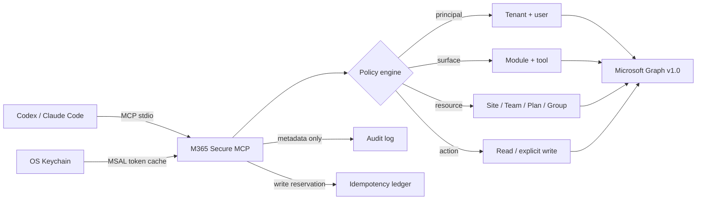

<p align="center">
  
</p>

<p align="center">
  <a href="https://github.com/bugroo/m365-secure-mcp/actions/workflows/ci.yml"></a>
  
  
  
  
  <a href="LICENSE"></a>
</p>

<p align="center">
  <strong>Broad Microsoft 365 capability. Narrow, explicit authority.</strong><br>
  A local-first MCP server for Codex, Claude Code, and standards-compliant clients.
</p>

<p align="center">
  <a href="#quick-start">Quick start</a> ·
  <a href="#capability-map">Capabilities</a> ·
  <a href="#security-control-plane">Security</a> ·
  <a href="docs/TOOL_CATALOG.md">Tool catalog</a> ·
  <a href="docs/ENTRA_SETUP.md">Entra setup</a>
</p>

---

## The control plane at a glance

<table>
  <tr>
    <td width="25%" valign="top">
      <h3>71 tools</h3>
      <p>Fixed contracts with strict schemas. No model-controlled Graph URL, method, scope, or headers.</p>
    </td>
    <td width="25%" valign="top">
      <h3>20 domains</h3>
      <p>Mail, Teams, SharePoint, Planner, Defender, Intune, Audit, Service Health, and more.</p>
    </td>
    <td width="25%" valign="top">
      <h3>4 policy layers</h3>
      <p>Principal, module, individual tool, and resource/action boundaries compose independently.</p>
    </td>
    <td width="25%" valign="top">
      <h3>0 delete tools</h3>
      <p>Read and write run as separate profiles. Every write is explicitly enabled and idempotent.</p>
    </td>
  </tr>
</table>

`m365-secure-mcp` is deliberately **not** a generic Microsoft Graph proxy.
It provides a large catalog while keeping the effective surface of each client
small, reviewable, and reproducible.



## Why this exists

Most Microsoft 365 MCP servers optimize for one of two extremes:

- a narrow workload that cannot grow beyond its original use case; or
- a universal Graph escape hatch that lets the model choose arbitrary paths,
  methods, bodies, and often destructive operations.

This server takes a third route: **broad coverage through fixed tools, then
deployment-time reduction through policy**.

| Boundary | What the operator decides | Fail-closed behavior |
|---|---|---|
| Identity | tenant, user object IDs, UPN domains | `/me` is verified before data access |
| Modules | service domains available to a process | default is `profile` only |
| Tools | exact allowlist and denylist | unknown or out-of-profile names stop startup |
| Resources | sites, teams, chats, groups, plans | non-allowlisted IDs are rejected locally |
| Writes | individual non-delete actions | separate process + two gates + approval |
| Egress | Graph API target | HTTPS `graph.microsoft.com/v1.0` only |

## Capability map

<table>
  <tr>
    <th align="left">Work</th>
    <th align="left">Collaboration</th>
    <th align="left">Content</th>
    <th align="left">Security & IT</th>
  </tr>
  <tr>
    <td valign="top">
      Mail<br>
      Calendar<br>
      Contacts<br>
      To Do<br>
      Planner
    </td>
    <td valign="top">
      Teams<br>
      Chats<br>
      Channels<br>
      Groups<br>
      People & Presence
    </td>
    <td valign="top">
      OneDrive<br>
      SharePoint<br>
      Excel structure<br>
      OneNote metadata<br>
      Directory profiles
    </td>
    <td valign="top">
      Defender incidents<br>
      Security alerts<br>
      Entra audit<br>
      Intune<br>
      Service Health
    </td>
  </tr>
</table>

### Read profile

Up to **60 read tools**, selected by module and optionally reduced to an exact
tool allowlist. Content-bearing responses are normalized, bounded, and marked
as untrusted external data.

### Write profile

**11 non-delete write actions**, each separately enabled:

```text
mail.create_draft            mail.send_draft
calendar.create_event        calendar.update_event
contacts.create              todo.create_task
todo.update_task             teams.send_channel_message
teams.send_chat_message      planner.create_task
planner.update_task
```

Every write requires a UUID idempotency key. The local SQLite ledger commits
before Graph is called; uncertain writes block automatic retry rather than risk
a duplicate external action.

## Security control plane

<table>
  <tr>
    <td width="50%" valign="top">
      <h3>Identity & tokens</h3>
      <ul>
        <li>Tenant-bound delegated identity</li>
        <li>Authorization code + PKCE</li>
        <li>No client secret</li>
        <li>OS Keychain token cache</li>
        <li>Device code disabled by default</li>
      </ul>
    </td>
    <td width="50%" valign="top">
      <h3>Graph boundary</h3>
      <ul>
        <li>Graph <code>v1.0</code> only</li>
        <li>No arbitrary endpoint tool</li>
        <li>No redirect following</li>
        <li>Signed pagination cursors</li>
        <li>Bounded retries and responses</li>
      </ul>
    </td>
  </tr>
  <tr>
    <td width="50%" valign="top">
      <h3>Prompt-injection resistance</h3>
      <ul>
        <li>M365 data is always untrusted</li>
        <li>HTML converted to visible plain text</li>
        <li>Scripts, styles, and SVG removed</li>
        <li>Control characters normalized</li>
        <li>Output character ceilings</li>
      </ul>
    </td>
    <td width="50%" valign="top">
      <h3>Write safety</h3>
      <ul>
        <li>Separate process and Graph consent</li>
        <li>Exact action allowlist</li>
        <li>SQLite idempotency ledger</li>
        <li>ETag concurrency for updates</li>
        <li>Per-tool rate limiting</li>
      </ul>
    </td>
  </tr>
</table>

Read the complete threat model and residual risks in
[SECURITY.md](SECURITY.md).

## Quick start

### 1. Install reproducibly

Requirements: Python 3.11+, [`uv`](https://docs.astral.sh/uv/), and a
single-tenant Microsoft Entra public-client registration.

```bash
git clone https://github.com/bugroo/m365-secure-mcp.git
cd m365-secure-mcp
uv sync --frozen --python python3.13
```

The committed `uv.lock` pins the resolved dependency graph. No npm, npx,
Node.js runtime, postinstall script, or client secret is involved.

### 2. Register the Entra application

Create a **single-tenant public desktop client**, add `http://localhost` as its
redirect URI, and grant only the delegated Graph permissions used by your
selected modules.

The complete permission matrix and `Sites.Selected` instructions are in
[docs/ENTRA_SETUP.md](docs/ENTRA_SETUP.md).

> [!IMPORTANT]
> Do not configure `api://<guid>` scopes for this local server. It obtains
> Microsoft Graph tokens directly and does not require “Expose an API,” OBO,
> Dynamic Client Registration, or a client secret.

### 3. Start with the smallest profile

```bash
export M365_TENANT_ID="<tenant-guid>"
export M365_CLIENT_ID="<public-application-guid>"
export M365_ALLOWED_USER_OBJECT_IDS="<user-object-guid>"
export M365_ALLOWED_UPN_DOMAINS="example.com"

uv run m365-secure-mcp --check-config
uv run m365-secure-mcp --list-tools
uv run m365-secure-mcp
```

The default configuration exposes only:

```text
m365_get_security_posture
m365_get_my_profile
```

Enable useful domains deliberately:

```bash
export M365_MODULES="profile,mail,calendar,files"
export M365_ENABLED_TOOLS="m365_search_mail,m365_list_calendar,m365_search_files"
```

## Connect an MCP client

<details>
<summary><strong>Codex</strong></summary>

Merge [examples/codex-read.toml](examples/codex-read.toml) into a trusted
project's `.codex/config.toml`, replace the placeholders, and keep:

```toml
default_tools_approval_mode = "prompt"
```

Do not combine a write profile with automatic tool approval.

</details>

<details>
<summary><strong>Claude Code</strong></summary>

Use [examples/claude-code-read.mcp.json](examples/claude-code-read.mcp.json) as
the local stdio definition. Keep actual tenant/user identifiers out of shared
repositories.

</details>

<details>
<summary><strong>Broad enterprise profile</strong></summary>

[examples/enterprise-read.env.example](examples/enterprise-read.env.example)
shows every domain and resource boundary. Treat it as a design worksheet:
remove anything the deployment does not need before granting Graph consent.

</details>

## Configuration model

```text
M365_MODULES
    └── service domains
        └── M365_ENABLED_TOOLS / M365_DISABLED_TOOLS
            └── exact visible tool surface
                └── resource allowlists
                    └── exact reachable data
```

Administrative domains—organization, Defender, Entra audit, Intune, and
Service Health—also require:

```bash
export M365_PRIVILEGED_MODULES_ENABLED=true
```

See the [full configuration reference](docs/CONFIGURATION.md).

## AADSTS500011: why this server avoids it

If Microsoft reports:

```text
The resource principal named api://<guid> was not found in the tenant
```

the client requested a token for a private API that is absent or unconsented in
that tenant. `m365-secure-mcp` requests Microsoft Graph scopes directly, so its
local architecture does not depend on that private resource principal.

Use [the authentication decision tree](docs/AUTH_TROUBLESHOOTING.md) to verify
tenant, public-client ID, redirect URI, and delegated permissions.

## Verification

```bash
uv run pytest -q
uv run ruff check .
uv run mypy src
uv run pip-audit
uv build
```

Current baseline:

| Check | Result |
|---|---|
| Tests | 40 passed |
| Ruff | clean |
| Mypy | strict, clean |
| Dependency audit | no known vulnerabilities |
| Package | wheel + source distribution |
| Full read-profile smoke test | exactly 60 tools |

Live Graph integration tests intentionally require a dedicated non-production
tenant and explicit operator consent.

## Design references

The architecture was informed by, but does not import runtime code from:

- [`aixolotl/microsoft-planner-mcp`](https://github.com/aixolotl/microsoft-planner-mcp)
- [`Softeria/ms-365-mcp-server`](https://github.com/Softeria/ms-365-mcp-server)
- [`merill/lokka`](https://github.com/merill/lokka)

The adopted and rejected patterns are documented in
[docs/REFERENCE_REVIEW.md](docs/REFERENCE_REVIEW.md).

## Documentation

| Document | Purpose |
|---|---|
| [Tool catalog](docs/TOOL_CATALOG.md) | All 71 contracts and their boundaries |
| [Security architecture](SECURITY.md) | Threat model, controls, residual risks |
| [Configuration](docs/CONFIGURATION.md) | Every environment variable and gate |
| [Entra setup](docs/ENTRA_SETUP.md) | Registration, delegated scopes, consent |
| [Authentication troubleshooting](docs/AUTH_TROUBLESHOOTING.md) | AADSTS diagnosis |
| [Reference review](docs/REFERENCE_REVIEW.md) | Comparative engineering decisions |

## License

Apache License 2.0. See [LICENSE](LICENSE).
