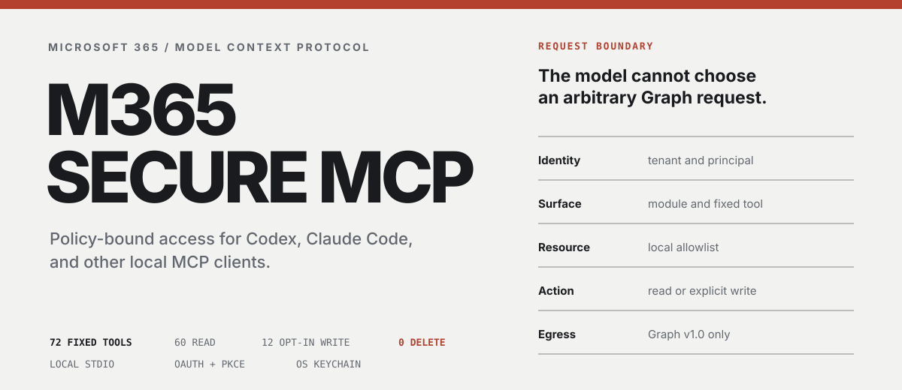
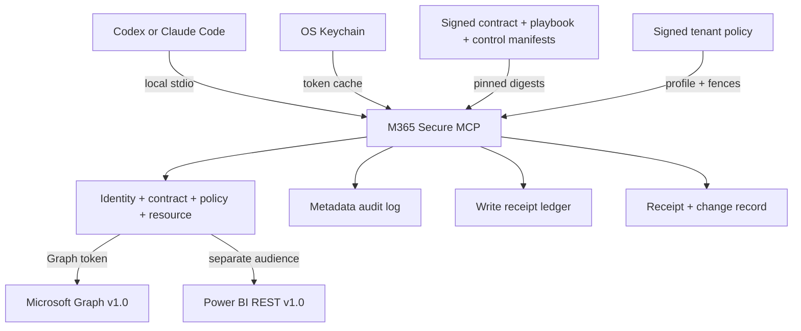

<p align="center">
  
</p>

[](https://github.com/bugroo/m365-secure-mcp/actions/workflows/ci.yml)
[](LICENSE)

A policy-bound Microsoft 365 Operations Control Plane for Codex, Claude Code,
and compatible MCP clients. It observes, diagnoses, plans, executes, verifies
and documents bounded administrative operations through fixed Microsoft Graph
contracts.

| Fixed tools | Compiled contracts | Signed playbooks | Read profile | Opt-in writes | Object deletes |
|---:|---:|---:|---:|---:|---:|
| 130 | 9 Entra contracts | 1 T0 workflow | 102 max | 27 | 0 |

| Observe and diagnose | Operate and automate | Assure and provide evidence |
|---|---|---|
| bounded inventory, preflight and operational evidence | fixed effects, proportional authorization and verified workflows | deterministic findings, receipts, change records and drift |

[Installation](#installation) | [Security model](#security-model) |
[Evidence](#evidence-contract) | [Diagnostics](#diagnose-before-serving) |
[Graph control plane](#microsoft-graph-control-plane) |
[Capabilities](#capabilities) |
[Private policy](#private-policy-and-resource-discovery) |
[Governance v2](docs/GOVERNANCE.md) |
[MSP deployment](#host-and-customer-tenants) |
[Tool catalog](docs/TOOL_CATALOG.md) |
[Secure Operations](docs/SECURE_OPERATIONS.md) |
[Roadmap](docs/ROADMAP.md) |
[Open-source boundary](docs/OPEN_SOURCE_BOUNDARY.md) |
[Entra setup](docs/ENTRA_SETUP.md)

## Microsoft Graph control plane

`m365-secure-mcp` is not a generic Microsoft Graph proxy, an autonomous tenant
administrator, a primarily read-only product or a compliance summarizer. The
model cannot choose a URL, HTTP method, permission scope, request body or
request header.

Microsoft Graph is the product surface. Microsoft 365 workloads are the
catalog behind it: Entra, Exchange-backed user data, Teams, SharePoint,
OneDrive, Planner, Intune, Windows 365, Defender, governance, licensing, and
Purview. Planner is one workload and its task-details implementation is one
example of the safe-write pattern; it is not the boundary of the project.

The operator starts with a broad catalog, then reduces each deployment by
identity, module, tool, resource, and action. Unknown or out-of-policy
configuration fails before the server starts.



### Four-plane design

| Plane | Authority | Runtime behavior |
|---|---|---|
| Build | signed global manifest, compiler, schemas, digests, SBOM and provenance | never generates tools at runtime |
| Governance | tenant-private signed profiles, allowlists and authorization overrides | may tighten a contract, never weaken it |
| Runtime | fixed MCP handlers, Graph v1.0 calls, preconditions, TOCTOU checks, external approval verification and post-read verification | cannot edit/sign policy or approve itself |
| Assurance | posture, findings, audit, receipts, drift and release checks | produces evidence; does not remediate autonomously |

The first compiled vertical slices are Entra Identity & Governance. Their
signed contract manifest contains eight bounded reads and one T1 write. A
separately signed playbook manifest composes two of those reads into one T0
Workload Identity Readiness workflow. The wider pre-existing catalog remains
statically coded while it is migrated contract by contract; the runtime never
translates tenant metadata into a new tool or workflow.

```bash
# Fails when generated definitions, permission matrix, digests,
# provenance, or CycloneDX SBOM are stale.
uv run m365-compile-contracts --check
```

The build inputs and outputs are
[global-manifest.json](src/m365_secure_mcp/contract_data/global-manifest.json),
[global-playbooks.json](src/m365_secure_mcp/contract_data/global-playbooks.json),
[global-controls.json](src/m365_secure_mcp/contract_data/global-controls.json),
[the compiled permission matrix](docs/CONTRACT_MATRIX.md),
[the compiled playbook matrix](docs/PLAYBOOK_MATRIX.md),
[the compiled control matrix](docs/CONTROL_MATRIX.md), and
[contract-artifacts](contract-artifacts/). The manifest is verified with a
pinned Ed25519 trust anchor before server construction. Contracts and
playbooks and posture controls use independent trust anchors. Editing a
manifest, signature, or signed tenant policy without the corresponding signer
fails closed.

Future posture-control signatures follow the external, two-role lifecycle in
the [control signing runbook](docs/CONTROL_SIGNING_RUNBOOK.md). The compiler
never signs, generates a production key or changes a trust anchor. Local
`uv build` output is marked `local-unattested` and `not-a-release`.

### What comes next

The signed T0 readiness playbook, reusable Change-safe T1 operator, Assurance
verticals, multi-tenant radar, Posture Control build foundation and Governance
v2 validation are implemented. The next canonical program is
**Secure Operations**: a semantic effect model, an operator foundation for
T2/dual-control/async/resumable execution, then bounded Identity, Intune,
Defender and operational-playbook slices.

Posture runtime is postponed until those operational slices exist. Its reduced
role is to turn bounded evidence into deterministic findings and
non-authorizing proposal candidates. A finding never calls or authorizes a
write.

The 27 current write registrations are frozen: no new legacy write, expanded
legacy effect or new legacy permission is accepted. Useful operations migrate
to compiled contracts and `ChangeSafeOperator`; equivalent legacy and compiled
effects may never be active together. See
[Secure Operations](docs/SECURE_OPERATIONS.md).

The complete implementation order, acceptance criteria, friction matrix and
permanent no-go rules live in the
[official implementation roadmap](docs/ROADMAP.md). Planned work is not part of
the active tool surface until it appears in the
[tool catalog](docs/TOOL_CATALOG.md) and
[compiled contract matrix](docs/CONTRACT_MATRIX.md).

## Installation

Requirements: Python 3.11+, [`uv`](https://docs.astral.sh/uv/), and a
single-tenant Microsoft Entra public-client registration whose delegated
permissions were added and consented by an administrator.

```bash
git clone https://github.com/bugroo/m365-secure-mcp.git
cd m365-secure-mcp
uv sync --frozen --python python3.13
```

The committed `uv.lock` pins the resolved dependency graph. This project has no
Node.js runtime, postinstall script, client secret, permission-grant tool, or
consent automation.

### Configure and seal the smallest profile

```bash
export M365_TENANT_ID="<tenant-guid>"
export M365_CLIENT_ID="<public-application-guid>"
export M365_ALLOWED_USER_OBJECT_IDS="<user-object-guid>"
export M365_ALLOWED_UPN_DOMAINS="example.com"

uv run m365-secure-mcp --check-config
uv run m365-secure-mcp --explain-permissions
uv run m365-secure-mcp --doctor
uv run m365-secure-mcp --list-tools
uv run m365-secure-mcp --export-policy \
  "$HOME/Library/Application Support/m365-secure-mcp/read-policy.json"
uv run m365-secure-mcp --policy-file \
  "$HOME/Library/Application Support/m365-secure-mcp/read-policy.json"
```

The export is a new owner-only `0600` file inside an owner-only `0700`
directory. Existing paths, symlinks, unknown settings, and broad permissions
are rejected. The private policy contains tenant/resource identifiers but no
token or client secret; keep it out of Git and client configuration.

The default configuration exposes only:

```text
m365_get_security_posture
m365_get_my_profile
```

Enable domains and individual tools deliberately:

```bash
export M365_MODULES="profile,mail,calendar,files"
export M365_ENABLED_TOOLS="m365_search_mail,m365_list_calendar,m365_search_files"
```

## Connect a client

<details>
<summary><strong>Codex</strong></summary>

Merge [examples/codex-read.toml](examples/codex-read.toml) into a trusted
project's `.codex/config.toml` and point it at the private policy file.
Routine reads do not need a confirmation dialog per operation. For writes
outside the compiled T1 standing-policy flow, keep:

```toml
default_tools_approval_mode = "prompt"
```

The compiled T1 Entra contract can use host allowlisting without a prompt on
every call only when its signed tenant policy keeps `standing_policy`.
Governance overrides to `explicit_plan`, T2/T3 actions, dual control and
break-glass remain deliberate host gates.

</details>

<details>
<summary><strong>Claude Code</strong></summary>

Use [examples/claude-code-read.mcp.json](examples/claude-code-read.mcp.json) as
the local stdio definition. It references the private policy by path; tenant
and user identifiers stay outside shared repositories.

</details>

<details>
<summary><strong>Enterprise read profile</strong></summary>

[examples/enterprise-read.env.example](examples/enterprise-read.env.example)
contains every domain and resource boundary. Remove anything the deployment
does not need before granting Graph consent.

</details>

## Security model

| Boundary | Operator control | Enforced behavior |
|---|---|---|
| Identity | tenant, user object IDs, UPN domains | `/me` is verified before data access |
| Surface | modules, exact tool allowlist and denylist | unknown or unavailable names stop startup |
| Resources | users, devices, Cloud PCs, files, sites, teams, plans, Office, Power BI, Purview and Entra | non-allowlisted identifiers are rejected locally |
| Writes | signed authorization floor plus exact semantic effect; object delete prohibited | standing T1 or host gate, TOCTOU revalidation, receipts |
| Egress | Microsoft APIs | pinned Graph v1.0, Power BI REST and validated Office download hosts |
| Evidence | every tool result | versioned schema, operation ID, explicit retry state |

Additional controls:

- admin-preconsented delegated OAuth authorization code flow with PKCE
- local JWT claim checks for tenant, issuer, audience, principal, lifetime and exact scope set
- OS Keychain token cache, with no plaintext token file
- one process, authority, token cache, audit namespace and receipt ledger per
  tenant/deployment kind/profile
- separate operator-principal, target-user and Planner-assignee allowlists
- a distinct Power BI token and audience; Graph bearer tokens are never reused
- no-follow, owner-only local audit and receipt files
- Graph `v1.0` only; Office redirects are manually validated and never receive the bearer token
- bounded OOXML parsing that rejects encrypted packages, traversal, entities, macros, ActiveX, OLE and ZIP bombs
- signed pagination cursors bound to tool, principal, resource, and query
- M365 content treated as untrusted input and converted to bounded plain text
- separate read and write processes
- signed build manifest plus tenant-private signed Governance policy
- complete-or-fail Entra posture snapshots, deployment-keyed drift digests,
  and encrypted tenant-local raw evidence
- authorization overrides can only move toward `explicit_plan`,
  `dual_control`, `break_glass_only`, or `prohibited`
- SQLite write reservation and durable metadata-only receipt before Graph is called
- resource-specific ETag concurrency on updates and per-tool rate limits
- no automatic retry after an ambiguous write response or transport failure
- post-write reads verify the exact requested fields before success is reported
- metadata-only audit events correlated by operation ID

### Authorization without approval fatigue

| Tier | Default path | Human friction |
|---|---|---|
| T0 | `automatic_read` after contract, identity, policy, fences and limits | none per call |
| T1 | `standing_policy` after signed tenant approval and full preflight | none per call by default |
| T2 | `explicit_plan` | approve the exact expiring plan |
| T3 | `dual_control` or `break_glass_only` | hard gate |
| T4 | `prohibited` | cannot execute |

The host retains override and halt authority. Approval is never accepted as a
tool argument or model-controlled boolean. A policy can harden the T1 contract
to `explicit_plan`; the current vertical slice then returns
`AWAITING_APPROVAL` without issuing a PATCH.

Read the complete threat model, assumptions, and residual risks in
[SECURITY.md](SECURITY.md).

## Evidence contract

Every tool returns two synchronized representations:

- the existing text content, for MCP clients that consume plain text
- `structuredContent`, validated against the advertised `outputSchema`

Failures are returned with MCP `isError=true`, a stable error code, a recovery
action, and explicit retry guidance. Agents no longer have to infer failure
from a string beginning with `Error:`.

```json
{
  "schema_version": "1.0",
  "ok": false,
  "tool": "m365_update_planner_task_details",
  "operation_id": "9dcf6f91-f3c7-4fbe-9a52-f34fd315a2ea",
  "content_type": "text/plain",
  "error": {
    "code": "GRAPH_CONCURRENCY_CONFLICT",
    "category": "conflict",
    "message": "resource changed since it was read",
    "action": "Re-read the resource and retry with its current ETag."
  },
  "retry": {
    "safe_to_retry": true,
    "reuse_idempotency_key": true
  },
  "evidence": {
    "policy_enforced": true,
    "audit_recorded": true,
    "write_receipt": {
      "operation_id": "9dcf6f91-f3c7-4fbe-9a52-f34fd315a2ea",
      "tool": "m365_update_planner_task_details",
      "idempotency_key": "58e0e271-06ba-4c3a-81e8-b70c1d43dc28",
      "status": "rejected",
      "created_at": "2026-07-26T12:00:00+00:00",
      "updated_at": "2026-07-26T12:00:01+00:00",
      "duplicate_suppressed": false,
      "uncertain_commit": false,
      "last_error_code": "GRAPH_CONCURRENCY_CONFLICT"
    }
  }
}
```

Successful writes additionally carry a metadata-only receipt with the same
operation ID, tool, idempotency key, status, timestamps, duplicate-suppression
flag, and uncertainty state. It contains no M365 body, subject, address,
filename, task text, or token.

## Diagnose before serving

The CLI can explain the effective deployment without starting MCP stdio:

```bash
# Signed release evidence, exact scopes, isolation, private state, and surface
uv run m365-secure-mcp --doctor

# Adds exact delegated-token scope comparison and read-only Graph /me
uv run m365-secure-mcp --doctor live

# Tool-by-tool reason for every Graph scope
uv run m365-secure-mcp --explain-permissions

# Operator-only policy summary plus a stable sha256 digest
uv run m365-secure-mcp --print-policy

# Read-only candidate discovery; never changes allowlists or exposes an MCP tool
uv run m365-secure-mcp --discover-resources \
  planner applications service_principals conditional_access \
  ediscovery_cases retention_labels
```

The offline doctor never signs in, calls Graph, changes a permission, repairs a
file or searches the workstation. It verifies both signed manifests, packaged
digests/provenance/CycloneDX SBOM, installed runtime dependencies, exact
tool-to-scope closure, tenant/profile namespacing and metadata for only known
configuration/application-owned paths. Every check returns one
`operator_action`.

Live mode may open the normal interactive Microsoft sign-in, but prints neither
the token nor M365 content. It compares validated token scope names in both
directions and performs the policy-checked `/me` read. Host oversight remains
informational because a stdio server cannot prove the host's approval, halt or
override controls.

## Capabilities

| Personal work | Collaboration | Content | Security and IT |
|---|---|---|---|
| Mail | Teams | OneDrive | Defender incidents |
| Calendar | Chats | SharePoint | Security alerts |
| Contacts | Channels | Word and PowerPoint | Entra audit |
| To Do | Groups | OneNote metadata | Intune |
| Planner | People and presence | Excel ranges | Windows 365 |
| Entra users/devices/apps | Power BI | OneNote content | CA, RBAC, drift, licenses |
|  |  |  | Purview eDiscovery/retention |

### Read profile

Up to **101 API read tools** (93 Microsoft Graph and 8 Power BI) are selected
by module and can be reduced to an exact allowlist. The local security-posture
tool remains visible, for a maximum read process of 102 tools. Content-bearing
responses are normalized, bounded, and marked as untrusted external data.

### Write profile

The write process exposes **27 existing actions**, each separately enabled.
Across the Graph-backed workloads they cover bounded Entra user/group and
application controls, Conditional Access state, mail/calendar/contact work,
Teams and Planner operations, Intune sync, Windows 365 reboot, and selected
Office/OneNote/Excel edits. Power BI refresh/rebind uses its separate API
audience under the same policy model. Exact tool contracts are listed in the
[tool catalog](docs/TOOL_CATALOG.md).

These registrations are under the binding
[legacy-write freeze](docs/SECURE_OPERATIONS.md#binding-legacy-write-freeze).
Only `m365_update_entra_user_operational_profile` currently uses the compiled
Change-safe contract path. The others remain compatibility surfaces pending
reviewed migration; no legacy receipt is represented as a governed
Change-safe operation.

Every write requires a UUID idempotency key. The local ledger commits before
Graph is called and returns a durable operation receipt. An uncertain result
blocks automatic retry indefinitely to avoid duplicate external actions.
`m365_get_write_operation` retrieves one receipt by operation ID or by the
exact tool/idempotency-key pair; it cannot enumerate the ledger and never calls
Graph.

<details>
<summary><strong>Expand the 130-tool capability map</strong></summary>

| Domain | Fixed reads | Opt-in writes |
|---|---:|---:|
| Mail, calendar, contacts | 10 | 5 |
| To Do, Planner, Teams | 14 | 7 |
| OneDrive and selected SharePoint | 11 | 0 |
| Word, PowerPoint, Excel and OneNote | 9 | 4 |
| People, groups, Entra users and devices | 11 | 4 |
| Defender, audit, Intune, Windows 365, health | 12 | 2 |
| Entra apps, governance, assurance, licensing, compliance | 22 | 3 |
| Power BI | 8 | 2 |
| Profile and organization | 2 | 0 |

Common/local evidence adds `m365_get_security_posture` and the write-only
receipt query. The full names, input bounds, permissions, and resource gates
are maintained in [docs/TOOL_CATALOG.md](docs/TOOL_CATALOG.md).

</details>

## Host and customer tenants

MSP operation uses one named process per tenant and privilege profile. A tool
call never accepts `tenant_id`; changing customer means changing to a
separately configured MCP entry.

```text
host-routine-read       customer-a-routine-read
host-routine-write      customer-a-privileged-read
host-privileged-read    customer-a-selected-write
```

Each customer profile binds the exact customer tenant, client registration,
signed-in object ID, API audience, scopes, resource allowlists, keychain cache,
audit namespace and idempotency ledger. A ledger opened under a different
tenant/profile namespace is rejected.

The admin must add delegated API permissions, grant admin consent, assign the
enterprise application to approved operators, and assign any required Entra
or workload role. The MCP can inspect grants but cannot create or modify API
permissions, OAuth consent, app-role assignments, directory roles or PIM
assignments. See [MSP multi-tenant deployment](docs/MSP_MULTI_TENANT.md).

### External MSP radar

`m365-msp-radar` runs fixed read-only Assurance across customers without
turning the MCP into a multi-tenant runtime. Its owner-only config contains one
opaque `msp:*` reference, one distinct private policy file and one fixed
Assurance tool per deployment:

```bash
cp examples/msp-radar.template.json /private/m365/radar.json
chmod 600 /private/m365/radar.json
uv run m365-msp-radar --config /private/m365/radar.json
```

Each entry launches a separate MCP child with its own tenant, App
Registration, keychain namespace, policy, baseline, audit and snapshot. At
most four children run concurrently. One failure is isolated and the
aggregate keeps only opaque deployment reference, operation/coverage status,
severity/alignment counts and evidence availability. It contains no Graph
content, tenant/resource ID, private path or child error body and exposes no
write or remediation route.

### Deliberate exclusions

`Directory.AccessAsUser.All`, `Directory.ReadWrite.All`, RBAC writes,
credential/password operations and application-only mailbox access are not
shortcuts this server takes. [Agent Registry/Agent ID write
APIs](https://learn.microsoft.com/en-us/graph/api/resources/agentid-platform-overview?view=graph-rest-beta)
and `AiEnterpriseInteraction.*` are also quarantined: the relevant Graph
surface is still beta. They will not be advertised as production tools until
stable endpoints, least-privileged permissions and data boundaries can be
tested.

Microsoft Purview is intentionally narrower than the operational modules.
The stable compliance surface can list/read only explicitly allowlisted
eDiscovery case metadata and retention-label definitions. It exposes no case
content, search execution, holds, exports, label assignment, policy mutation,
close, or delete action.

## Private policy and resource discovery

Governance schema `1.0` remains supported without migration or tool-surface
changes. Schema `2.0` adds signed Posture Control Library configuration and
fails closed on manifest/version drift, unknown or retired controls, relaxed
freshness, ambiguous exceptions and private-resource fence violations. It
does not run controls. See [Signed tenant Governance](docs/GOVERNANCE.md) and
the fabricated
[v2 template](examples/governance-policy-v2.template.json).

Resource IDs belong in one local owner-only policy, not in a public repository
or repeated across client configs. The operator can discover candidates through
fixed read-only Graph calls:

```bash
uv run m365-secure-mcp --policy-file "/private/read-policy.json" \
  --discover-resources planner teams chats groups

uv run m365-secure-mcp --policy-file "/private/admin-read-policy.json" \
  --discover-resources users directory_devices managed_devices cloudpcs \
  applications service_principals conditional_access \
  ediscovery_cases retention_labels

uv run m365-secure-mcp --policy-file "/private/routine-read-policy.json" \
  --discover-resources drives planner teams chats groups

uv run m365-secure-mcp --policy-file "/private/powerbi-read-policy.json" \
  --discover-resources powerbi_workspaces

# After approved workspace IDs are added to the private policy:
uv run m365-secure-mcp --policy-file "/private/powerbi-read-policy.json" \
  --discover-resources powerbi_content
```

Discovery is deliberately outside the MCP tool surface. It prints untrusted
metadata and whether each ID is already allowed, but it never edits the policy
or selects resources on the operator's behalf.

Use separate private policy files and app registrations for routine read,
routine write, privileged read, and privileged write. See
[Ownership and migration](docs/OWNERSHIP_AND_MIGRATION.md) for the staged
replacement of third-party Graph proxies without losing break-glass coverage.

## Entra Assurance: posture snapshot and drift

`m365_get_entra_identity_governance_posture` is the first Assurance vertical
slice. It is a compiled T0 `automatic_read` contract that observes four complete
domains:

- Conditional Access policy security configuration;
- permanent directory-role assignments;
- active PIM role-assignment instances;
- eligible PIM role-assignment instances.

The tool has no target, tenant, URL, method, approval, or write parameter. It
requests only `Policy.Read.All` and `RoleManagement.Read.Directory` in addition
to the server's base `User.Read`; the operator needs the `Global Reader` role.
An administrator must add and consent those delegated permissions manually.
The MCP cannot request them, grant consent, assign the role, or activate PIM.

Enable it in a separate privileged-read process:

```bash
export M365_PROFILE="read"
export M365_MODULES="profile,assurance"
export M365_ENABLED_TOOLS="m365_get_entra_identity_governance_posture"
export M365_PRIVILEGED_MODULES_ENABLED="true"
export M365_GOVERNANCE_POLICY_PATH="/private/m365/governance-policy.signed.json"
export M365_GOVERNANCE_PUBLIC_KEY_PATH="/private/m365/governance-signing.pub"
```

The active signed profile must be `privileged-read` and include
`entra.identity_governance.posture.snapshot`. There is no per-call approval:
contract, identity, scopes, signed policy, tenant fence, pagination bounds and
collection shape are checked automatically. Any incomplete page, pagination
loop, unknown Conditional Access state, size overflow, or policy change fails
the whole operation; partial data is never labeled as a valid snapshot.

The MCP response contains only counts, deterministic findings, coverage,
tenant-local HMAC digests and an opaque snapshot reference. Policy names,
conditions, resource IDs and principal IDs are not returned. The full
normalized evidence is encrypted into an owner-only tenant-specific local file;
its key stays in the OS Keychain. There is deliberately no MCP tool to retrieve
or decrypt that file.

### Establish a signed tenant baseline

The first successful run returns four `hmac-sha256:` domain digests and reports
the baseline as `not_evaluated`. After reviewing the tenant, copy those digests
into the private unsigned Governance policy:

```json
{
  "identity_governance_baseline": {
    "baseline_id": "approved-entra-governance",
    "version": 1,
    "captured_at": "<captured_at from the posture result>",
    "source_snapshot_reference": "snapshot:<snapshot UUID>",
    "domains": {
      "conditional_access": {
        "expected_digest": "<hmac-sha256 digest>",
        "drift_severity": "critical"
      },
      "permanent_role_assignments": {
        "expected_digest": "<hmac-sha256 digest>",
        "drift_severity": "high"
      },
      "active_role_assignments": {
        "expected_digest": "<hmac-sha256 digest>",
        "drift_severity": "high"
      },
      "eligible_role_assignments": {
        "expected_digest": "<hmac-sha256 digest>",
        "drift_severity": "high"
      }
    },
    "exceptions": []
  }
}
```

Review and sign a new policy version with `m365-governance sign`. Runtime
cannot edit or promote a baseline. A later mismatch becomes a deterministic
`DRIFT.*` finding using the severity in the signed policy. Exceptions must also
be signed, domain/control-specific and expiring. Assurance never remediates,
retries a write, or changes Governance.

The digests are deliberately bound to the deployment's local key and tenant.
They cannot be reused across customers or after losing/rotating that key; in
that case the administrator must review and sign a new baseline.

### Permission-grant drift for allowlisted applications

`m365_get_entra_permission_grant_drift` is the next compiled T0 Assurance
slice. It reads the complete delegated grants and application-role assignments
of service principals selected in signed Governance, resolves their resource
catalogs, and compares the result with permissions derived from exact compiled
contract IDs. The fixed runtime base scope `User.Read` is included
automatically. The tool never accepts a service-principal ID, URL, method,
filter, permission name, consent action, or remediation command.

Use a separate `privileged-read` process with the exact tool allowlist:

```bash
export M365_PROFILE="read"
export M365_MODULES="profile,assurance"
export M365_ENABLED_TOOLS="m365_get_entra_permission_grant_drift"
export M365_PRIVILEGED_MODULES_ENABLED="true"
export M365_ALLOWED_SERVICE_PRINCIPAL_IDS="<approved object ID[,object ID...]>"
export M365_GOVERNANCE_POLICY_PATH="/private/m365/governance-policy.signed.json"
export M365_GOVERNANCE_PUBLIC_KEY_PATH="/private/m365/governance-signing.pub"
```

The Entra administrator manually adds and consents `Directory.Read.All`; the
operator must hold a supported read role such as `Directory Readers` or
`Global Reader`. The MCP cannot add permissions, grant or revoke consent,
assign roles, or edit the app registration.

The same target IDs must be present in both
`resources.service_principals` and `M365_ALLOWED_SERVICE_PRINCIPAL_IDS`.
Expected permissions come only from `contract_ids` in the signed private
baseline:

```json
{
  "permission_grant_baseline": {
    "baseline_id": "approved-msp-runtime-apps",
    "version": 1,
    "targets": [
      {
        "service_principal_id": "<approved object ID>",
        "contract_ids": [
          "entra.permission_grants.drift.snapshot"
        ],
        "allowed_delegated_consent_types": [
          "AllPrincipals"
        ]
      }
    ],
    "exceptions": []
  },
  "resources": {
    "service_principals": [
      "<same approved object ID>"
    ]
  }
}
```

Extra delegated permissions are high-severity findings. Application
permissions are critical because this product's compiled contracts use
delegated access only. Missing expected permissions and consent-type mismatches
are reported separately. An exception must identify the exact target,
permission kind, resource app, permission value and consent type; it must be
signed, justified and expiring. There is no automatic revocation or baseline
promotion.

The public MCP result uses opaque deployment-keyed references and public
permission names. Tenant IDs, object IDs, grant IDs, principal IDs and resource
catalog IDs remain in the encrypted tenant-local snapshot. Coverage is stated
as `complete_for_signed_targets`: this first slice intentionally evaluates only
service principals whose expected capabilities are already represented by the
compiled global manifest.

### Profile scope and contract debt

`m365_get_entra_profile_debt_posture` is the fourth compiled T0 Assurance
vertical. It correlates six independently meaningful views for the active
`privileged-read` profile:

- exact scope closure of the contracts selected in signed Governance;
- delegated scope names from the already validated Graph token;
- complete signed grant posture for this deployment's App Registration;
- policy version and customer-approved review age;
- recent success/failure evidence from the known owner-only audit path;
- private Governance resource fences versus exact local runtime allowlists.

The tool accepts only `response_format`. It cannot choose a scope, app,
tenant, URL, method, baseline or remediation. Grant collection reuses the
fixed permission-drift contract and requires `Directory.Read.All`; the Entra
administrator still adds, consents, removes or changes permissions manually.

Use a dedicated profile process and expose only this public tool. Its internal
permission-evidence node remains a separately signed contract:

```bash
export M365_PROFILE="read"
export M365_MODULES="profile,assurance"
export M365_ENABLED_TOOLS="m365_get_entra_profile_debt_posture"
export M365_PRIVILEGED_MODULES_ENABLED="true"
export M365_ALLOWED_SERVICE_PRINCIPAL_IDS="<this app service-principal object ID>"
export M365_GOVERNANCE_POLICY_PATH="/private/m365/governance-policy.signed.json"
export M365_GOVERNANCE_PUBLIC_KEY_PATH="/private/m365/governance-signing.pub"
```

The private policy must enable both
`entra.permission_grants.drift.snapshot` and
`entra.profile_debt.posture.snapshot`, bind the current service principal to
that exact contract closure, and define customer severities:

```json
{
  "policy_version": 2,
  "profiles": {
    "privileged-read": {
      "enabled_contracts": [
        "entra.permission_grants.drift.snapshot",
        "entra.profile_debt.posture.snapshot"
      ]
    }
  },
  "permission_grant_baseline": {
    "baseline_id": "msp-runtime-profile",
    "version": 1,
    "targets": [
      {
        "service_principal_id": "<this app service-principal object ID>",
        "contract_ids": [
          "entra.permission_grants.drift.snapshot",
          "entra.profile_debt.posture.snapshot"
        ],
        "allowed_delegated_consent_types": ["AllPrincipals"]
      }
    ],
    "exceptions": []
  },
  "profile_debt_baseline": {
    "baseline_id": "msp-profile-debt",
    "version": 1,
    "minimum_policy_version": 2,
    "maximum_policy_age_days": 90,
    "evidence_window_days": 30,
    "persistent_failure_threshold": 3,
    "severities": {
      "PROFILE_CURRENT_APP_BASELINE_MISSING": "critical",
      "PROFILE_PERMISSION_GRANT_DRIFT": "critical",
      "PROFILE_TOKEN_SCOPE_MISSING": "high",
      "PROFILE_TOKEN_SCOPE_UNEXPECTED": "critical",
      "PROFILE_CONTRACT_BASELINE_MISMATCH": "high",
      "PROFILE_POLICY_VERSION_STALE": "medium",
      "PROFILE_POLICY_AGE_STALE": "medium",
      "PROFILE_CONTRACT_NO_RECENT_EVIDENCE": "low",
      "PROFILE_CONTRACT_PERSISTENT_FAILURE": "high",
      "PROFILE_RESOURCE_ALLOWLIST_UNUSED": "low",
      "PROFILE_RESOURCE_FENCE_MISMATCH": "high"
    },
    "exceptions": []
  }
}
```

Every exception is signed, control-specific, subject-specific and expiring.
Missing audit or current-app evidence is `not_evaluated`, never “aligned”.
MCP output contains counts, public contract/scope names and opaque references;
private IDs and normalized evidence stay encrypted in the tenant-local
snapshot. The operation performs no Graph write, consent change, policy
change, baseline promotion or automatic remediation.

### Application credential posture

`m365_get_entra_app_credential_posture` adds a third compiled T0 Assurance
workflow for app registrations selected by the tenant administrator. It
detects expiring or expired credentials, password-secret use, insufficient
ownership and redundant active credentials against a signed private baseline.
It does not enumerate the tenant and accepts no application ID, Graph path,
query, credential value or remediation command.

```bash
export M365_PROFILE="read"
export M365_MODULES="profile,assurance"
export M365_ENABLED_TOOLS="m365_get_entra_app_credential_posture"
export M365_PRIVILEGED_MODULES_ENABLED="true"
export M365_ALLOWED_APPLICATION_IDS="<approved object ID[,object ID...]>"
export M365_GOVERNANCE_POLICY_PATH="/private/m365/governance-policy.signed.json"
export M365_GOVERNANCE_PUBLIC_KEY_PATH="/private/m365/governance-signing.pub"
```

The tenant administrator manually adds and consents only
`Application.Read.All`; a supported operator role is `Directory Readers` or
`Global Reader`. The exact application object IDs must appear in both
`M365_ALLOWED_APPLICATION_IDS` and signed `resources.applications`.

```json
{
  "application_credential_baseline": {
    "baseline_id": "approved-msp-application-posture",
    "version": 1,
    "targets": [
      {
        "application_id": "<approved application object ID>",
        "minimum_owner_count": 2,
        "expiry_warning_days": 30,
        "password_credentials_allowed": false,
        "maximum_active_password_credentials": 0,
        "maximum_active_key_credentials": 2
      }
    ],
    "exceptions": []
  },
  "resources": {
    "applications": [
      "<same approved application object ID>"
    ]
  }
}
```

Graph documents that explicitly selecting `keyCredentials` can return public
key values. This workflow deliberately avoids that query, immediately reduces
the default application response, fails closed if Graph unexpectedly returns
key or password material, and never persists names, secret hints, thumbprints,
`secretText` or `key`. Raw object IDs and normalized validity metadata are
encrypted in the owner-only tenant-local Assurance store; MCP receives only
counts, deterministic findings, opaque HMAC references and a snapshot
reference.

Exceptions are signed and expiring. Credential findings additionally require
the exact credential kind and key ID inside the private policy; an application
level exception cannot silently suppress all credential findings. The tool
never rotates, adds or removes credentials and never changes application
owners.

The control defaults follow Microsoft's guidance to prefer managed identity,
federation or certificates over client secrets, review credential expiry, keep
few credentials, and maintain accountable application owners:
[app-registration security](https://learn.microsoft.com/en-us/entra/identity-platform/security-best-practices-for-app-registration),
[credential management](https://learn.microsoft.com/en-us/entra/identity-platform/how-to-add-credentials),
and [application ownership](https://learn.microsoft.com/en-us/entra/identity/enterprise-apps/what-is-application-management).

### Workload Identity Readiness

`m365_get_entra_workload_identity_readiness` is a signed T0 playbook over the
permission-grant drift and application-credential posture contracts. Its DAG,
node contracts, permission closure and output fields are fixed at build time.
It adds no Graph operation: its exact delegated scope closure is
`Application.Read.All` plus `Directory.Read.All`, with the runtime base
`User.Read`.

Enable it only in a signed `privileged-read` Governance profile:

```bash
export M365_PROFILE="read"
export M365_MODULES="profile,assurance"
export M365_ENABLED_TOOLS="m365_get_entra_workload_identity_readiness"
export M365_PRIVILEGED_MODULES_ENABLED="true"
export M365_ALLOWED_APPLICATION_IDS="<approved object ID[,object ID...]>"
export M365_ALLOWED_SERVICE_PRINCIPAL_IDS="<approved object ID[,object ID...]>"
export M365_GOVERNANCE_POLICY_PATH="/private/m365/governance-policy.signed.json"
export M365_GOVERNANCE_PUBLIC_KEY_PATH="/private/m365/governance-signing.pub"
```

The private policy must enable
`entra.workload_identity.readiness.playbook`, pin the current
`playbook_manifest_digest`, enable both child contracts in the same profile,
and contain both signed baselines and both local resource fences. The Entra
administrator still adds and consents the two delegated permissions manually.

There is no per-call confirmation: `automatic_read` executes after the signed
contract, playbook, tenant profile, identity, scopes, resource fences and
baselines pass. The nodes retain their independent pagination, policy-change
and encrypted-snapshot checks. A failed or incomplete node halts the playbook
and reports `not_evaluated`; partial evidence is never promoted to complete.

Application and service-principal observations are correlated with an opaque,
tenant-local HMAC workload reference. Raw IDs and normalized evidence remain
inside the two encrypted tenant-local snapshots. The public result contains
bounded counts, deterministic findings and evidence references only. The
playbook cannot grant consent, rotate credentials, change owners or invoke any
write.

Upgrading to `0.9.0` introduces the separately signed playbook manifest and
extends the private policy schema. Governance policies signed by older
versions must be reviewed, exported with the current schema and explicitly
re-signed, even when no playbook is enabled. To enable readiness, the
Governance owner must additionally review the
[playbook matrix](docs/PLAYBOOK_MATRIX.md), set the exact playbook digest and
selection, configure both baselines, and sign the next policy version. Runtime
never migrates or re-signs tenant policy.

## First governed T1 write: Entra operational profile

`m365_update_entra_user_operational_profile` updates exactly one allowlisted
cloud-managed `Member` user and accepts only:

- `department`
- `job_title` → Graph `jobTitle`
- `office_location` → Graph `officeLocation`

Password, authentication, account state, identity, license, role, phone,
address, mail, UPN and usage-location fields are not in the schema. Before
PATCH, the handler verifies the tenant and both user allowlists, rejects
synced/guest/protected users, and checks direct, eligible and
role-assignable-group-derived directory roles. It then revalidates the signed
manifest, policy, target state and privilege fences immediately before the
write.

In addition to the server's base `User.Read` identity check, the contract
permissions are deliberately narrower than `Directory.ReadWrite.All`:

```text
User.ReadUpdate.All
RoleManagement.Read.Directory
GroupMember.Read.All
```

An administrator must add and consent these permissions manually in Entra.
The MCP has no consent or permission-grant command.
For this first strict privilege fence, the delegated operator needs both the
`User Administrator` and `Global Reader` roles: one authorizes the bounded user
update, while the other permits the direct/PIM role-status preflight.

### Create the private signed Governance policy

Copy [the tenant-neutral template](examples/governance-policy.template.json)
to an owner-only private directory, replace its placeholders, and use the
current `manifest_digest` from
[contract-digests.json](contract-artifacts/contract-digests.json).
Do not commit the completed policy or signer.
The key-generation command creates an owner-only, passphrase-encrypted Ed25519
signer and prompts only in this Governance-plane operation—not during MCP
runtime.

```bash
uv run m365-governance generate-key \
  --signer "/private/m365/governance-signing.pem" \
  --verifier "/private/m365/governance-signing.pub"

uv run m365-governance sign \
  --input "/private/m365/governance-policy.json" \
  --signer "/private/m365/governance-signing.pem" \
  --output "/private/m365/governance-policy.signed.json" \
  --key-id "customer-a-governance-2026"

uv run m365-governance verify \
  --policy "/private/m365/governance-policy.signed.json" \
  --verifier "/private/m365/governance-signing.pub"
```

Enable the exact action and the same target in the local runtime fence:

```bash
export M365_PROFILE="write"
export M365_WRITE_ENABLED="true"
export M365_WRITE_ACTIONS="entra.user.operational_profile.update"
export M365_ALLOWED_TARGET_USER_IDS="<approved-user-guid>"
export M365_GOVERNANCE_POLICY_PATH="/private/m365/governance-policy.signed.json"
export M365_GOVERNANCE_PUBLIC_KEY_PATH="/private/m365/governance-signing.pub"
```

`standing_policy` follows this deterministic sequence without a per-call
dialog:

```text
preflight → Permission Impact Preview → fences → standing authorization
→ policy/contract/user revalidation → PATCH → post-read → receipt/change record
```

The public receipt and change record contain digests, field names, a
non-reversible target fingerprint and recovery guidance—not the old or new
Microsoft 365 values. Those values exist only in an encrypted, tenant-local
recovery capsule backed by the OS Keychain. Any post-write ambiguity returns
`EXECUTED_UNCERTAIN` and forbids automatic retry.

### Reusable Change-safe operator

Version `0.10.0` extracts the T1 flow into a contract-independent engine.
Routine execution remains low-friction: a signed `standing_policy` needs no
approval prompt. The engine nevertheless creates a stable plan from the
idempotency key, enforces its expiry and signed UTC write window, rechecks the
contract, policy, operator, immutable target and precondition digest, then
performs contract-specific verification.

The internal `preview` path runs the complete preflight and Permission Impact
Preview without calling PATCH. It explicitly reports
`PREFLIGHT_COMPLETE_NO_EFFECT`; it is not described as a Microsoft Graph
simulation.

If Governance hardens this T1 contract to `explicit_plan`, configure a separate
host/broker authority:

```bash
uv run m365-approval generate-key \
  --signer "/private/m365/approval-signing.pem" \
  --verifier "/private/m365/approval-signing.pub"

export M365_APPROVAL_BROKER_DIR="/private/m365/approvals"
export M365_APPROVAL_PUBLIC_KEY_PATH="/private/m365/approval-signing.pub"
```

The first call returns `AWAITING_APPROVAL` and writes an owner-only private
request named `<plan-id>.request.json`. An operator or host broker signs that
exact request outside MCP runtime:

```bash
uv run m365-approval sign \
  --request "/private/m365/approvals/<plan-id>.request.json" \
  --signer "/private/m365/approval-signing.pem" \
  --output "/private/m365/approvals/<plan-id>.approval.json" \
  --key-id "customer-a-change-approver" \
  --expected-plan-digest "sha256:<reviewed-plan-digest>"
```

Repeating the same contracted call with the same idempotency key reuses the
unexpired plan. Runtime verifies the Ed25519 signature and exact binding to the
tenant, profile, signed-in operator, contract/policy digests, normalized
parameter digest, target fingerprint, preconditions, impact preview and
expiry. It consumes the approval once after TOCTOU revalidation and before
PATCH. No MCP tool accepts an approval document or `approved=true`.

The request contains digests, field names, permissions, roles and fences for
operator review, but not the requested or previous Microsoft 365 values. The
approval signer is separate from Governance signing material. Microsoft Entra
permissions and admin consent remain manual and are never requested by either
CLI.

Upgrading from `0.9.0` to `0.10.0` does not change the signed contract or
playbook manifest digests. Existing policies remain bound to the same global
capabilities. Only tenants that select an `explicit_plan` override need the
external approval broker; `standing_policy` behavior remains prompt-free.

Version `0.11.0` adds the signed profile-debt contract and the signed
`policy_version`/`profile_debt_baseline` Governance fields. This intentionally
changes the global manifest digest. Existing tenants must review the new
contract selection, update `contract_manifest_digest`, and re-sign their
private policy; runtime never migrates or signs a tenant policy automatically.

Version `0.12.0` packages the deterministic contract/playbook digests,
provenance and CycloneDX SBOM inside the installed distribution and verifies
them through offline doctor. It does not change either signed manifest digest,
so a policy already re-signed for `0.11.0` needs no capability migration.
Distribution signature/attestation verification remains an external install
or release-pipeline responsibility; doctor verifies installed consistency and
never self-updates or repairs files.

Version `0.13.0` adds the external read-only MSP radar. It changes no contract
or playbook manifest digest and adds no Graph permission.

## Selected administrative writes

Administrative writes remain invisible until every layer agrees:

```bash
export M365_PROFILE=write
export M365_WRITE_ENABLED=true
export M365_PRIVILEGED_WRITES_ENABLED=true
export M365_WRITE_ACTIONS=entra.update_service_principal
export M365_ALLOWED_SERVICE_PRINCIPAL_IDS="<approved-object-guid>"
```

The corresponding Entra registration must also have the delegated Graph
permission and the signed-in operator must hold a supported Entra role.
User writes cannot touch passwords, authentication methods, identities or
licenses. Role-assignable groups, and groups whose role status cannot be
confirmed, are rejected before any metadata or membership write.
Application and service-principal updates cannot touch secrets, certificates,
owners, redirect URIs, app roles, or consent grants. Conditional Access updates
can change only `state` and `displayName`; conditions and controls are
read-only. No current runtime DELETE exists. Future exact relationship removal
is allowed only through a compiled `relationship_remove` contract whose fixed
path ends literally in `/$ref`; object deletion remains prohibited.

## Workload example: Planner task details

`m365_update_planner_task_details` closes the gap between basic Planner task
fields and the separate Graph details resource. It can set a non-empty
description, choose the card preview, add checklist entries, rename existing
entries, and change their checked state.

```bash
export M365_PROFILE="write"
export M365_WRITE_ENABLED="true"
export M365_WRITE_ACTIONS="planner.update_task_details"
export M365_ALLOWED_PLAN_IDS="<approved-plan-id>"
```

The tool requires the `details_etag` returned by `m365_get_planner_task`:

```json
{
  "task_id": "task-id",
  "plan_id": "approved-plan-id",
  "details_etag": "W/\"details-etag\"",
  "description": "Implementation notes",
  "preview_type": "checklist",
  "checklist_additions": [
    {"title": "Validate deployment", "is_checked": false}
  ],
  "checklist_updates": [
    {
      "item_id": "95e27074-6c4a-447a-aa24-9d718a0b86fa",
      "is_checked": true
    }
  ],
  "idempotency_key": "58e0e271-06ba-4c3a-81e8-b70c1d43dc28"
}
```

> [!CAUTION]
> The basic task `etag` and `details_etag` are different concurrency tokens.
> The tool re-reads both the task and its details, verifies the allowlisted
> plan, caps the resulting checklist at 20, and refuses stale ETags or unknown
> item UUIDs. Checklist deletion by `null`, whole-object replacement,
> reference mutation, and description clearing are not exposed.

Checklist additions use deterministic UUIDv5 identifiers derived from the
idempotency key. A `204 No Content` response is followed by a verification
read. The result includes a durable receipt; it can be queried later with
`m365_get_write_operation`. The only required delegated Graph permission is
`Tasks.ReadWrite`.

## Entra registration

Create a **single-tenant public desktop client**, add `http://localhost` as its
redirect URI, then have an administrator add and consent only the delegated
permissions printed by `--explain-permissions`. Runtime token requests use
the preconsented `/.default` set; the MCP never starts a dynamic permission
grant.

> [!IMPORTANT]
> Do not configure an `api://<guid>` scope for this local server. It requests
> Microsoft Graph scopes directly and does not require Expose an API, OBO,
> Dynamic Client Registration, or a client secret.

The full permission matrix and `Sites.Selected` instructions are in
[docs/ENTRA_SETUP.md](docs/ENTRA_SETUP.md).

### AADSTS500011

If Microsoft reports:

```text
The resource principal named api://<guid> was not found in the tenant
```

the client requested a token for a private API that is absent or unconsented in
that tenant. This server does not depend on that private resource principal.

Use the [authentication decision tree](docs/AUTH_TROUBLESHOOTING.md) to verify
the tenant, public-client ID, redirect URI, and delegated permissions.

## Configuration

```text
modules
  -> exact visible tool surface
     -> resource allowlists
        -> exact reachable data
```

Administrative domains such as Defender, Entra audit, Intune, and Service
Health, Entra applications, governance, licensing, domains, and Purview
compliance also require:

```bash
export M365_PRIVILEGED_MODULES_ENABLED=true
```

Privileged write actions additionally require:

```bash
export M365_PRIVILEGED_WRITES_ENABLED=true
```

See the [full configuration reference](docs/CONFIGURATION.md).

## Verification

```bash
uv run pytest -q
uv run ruff check .
uv run mypy src
uv run pip-audit
uv build
```

Current baseline:

| Check | Result |
|---|---|
| Tests | 340 passed |
| Ruff | clean |
| Mypy | strict, clean |
| Dependency audit | no known vulnerabilities |
| Package | wheel and source distribution |
| Full read-profile smoke test | 101 API reads + security posture |

Live Graph integration tests require a dedicated non-production tenant and
explicit operator consent.

## Documentation

| Document | Purpose |
|---|---|
| [Tool catalog](docs/TOOL_CATALOG.md) | All 130 fixed tools and their boundaries |
| [Secure Operations](docs/SECURE_OPERATIONS.md) | Product pillars, legacy-write freeze, effect model and operational slices |
| [Compiled playbook matrix](docs/PLAYBOOK_MATRIX.md) | Signed DAG, contract closure and exact permissions |
| [Compiled control matrix](docs/CONTROL_MATRIX.md) | Signed public control IDs, evaluator bindings, evidence dependencies and framework mappings |
| [Control signing runbook](docs/CONTROL_SIGNING_RUNBOOK.md) | Offline custody, signing, rotation, compromise response and future release gate |
| [Signed tenant Governance](docs/GOVERNANCE.md) | Governance v1 compatibility and v2 Control Library policy validation |
| [Workflow evaluations](evaluations/README.md) | Sanitized security and failure-mode fixtures |
| [Official roadmap](docs/ROADMAP.md) | Prioritized vertical slices, acceptance criteria, friction and no-go rules |
| [Security architecture](SECURITY.md) | Threat model, controls, residual risks |
| [Configuration](docs/CONFIGURATION.md) | Every environment variable and gate |
| [Entra setup](docs/ENTRA_SETUP.md) | Registration, delegated scopes, consent |
| [Authentication troubleshooting](docs/AUTH_TROUBLESHOOTING.md) | AADSTS diagnosis |
| [Reference review](docs/REFERENCE_REVIEW.md) | Comparative engineering decisions |
| [Ownership and migration](docs/OWNERSHIP_AND_MIGRATION.md) | Public core, private deployment, and Lokka transition |
| [MSP multi-tenant deployment](docs/MSP_MULTI_TENANT.md) | Host/customer isolation, GDAP and admin-consent workflow |
| [Open-source boundary](docs/OPEN_SOURCE_BOUNDARY.md) | Public security core, private customer operations, licensing and integration boundary |

## Engineering references

Primary specifications:

- [Model Context Protocol tools](https://modelcontextprotocol.io/specification/2025-11-25/server/tools)
- [Microsoft Graph permissions reference](https://learn.microsoft.com/en-us/graph/permissions-reference)
- [Conditional Access policy list](https://learn.microsoft.com/en-us/graph/api/conditionalaccessroot-list-policies?view=graph-rest-1.0)
- [Directory role assignments](https://learn.microsoft.com/en-us/graph/api/rbacapplication-list-roleassignments?view=graph-rest-1.0)
- [Active role schedule instances](https://learn.microsoft.com/en-us/graph/api/rbacapplication-list-roleassignmentscheduleinstances?view=graph-rest-1.0)
- [Eligible role schedule instances](https://learn.microsoft.com/en-us/graph/api/rbacapplication-list-roleeligibilityscheduleinstances?view=graph-rest-1.0)
- [Planner task details API](https://learn.microsoft.com/en-us/graph/api/plannertaskdetails-update?view=graph-rest-1.0)
- [Microsoft Purview eDiscovery case API](https://learn.microsoft.com/en-us/graph/api/security-casesroot-list-ediscoverycases?view=graph-rest-1.0)
- [Microsoft Purview retention labels API](https://learn.microsoft.com/en-us/graph/api/security-labelsroot-list-retentionlabel?view=graph-rest-1.0)
- [Power BI REST API](https://learn.microsoft.com/en-us/rest/api/power-bi/)

The architecture was informed by, but does not import runtime code from:

- [`aixolotl/microsoft-planner-mcp`](https://github.com/aixolotl/microsoft-planner-mcp)
- [`Softeria/ms-365-mcp-server`](https://github.com/Softeria/ms-365-mcp-server)
- [`merill/lokka`](https://github.com/merill/lokka)

The adopted and rejected patterns are recorded in
[docs/REFERENCE_REVIEW.md](docs/REFERENCE_REVIEW.md).

## License

Apache License 2.0. See [LICENSE](LICENSE). Downstream commercial use and the
separate trademark/customer-data boundary are summarized in
[the open-source boundary](docs/OPEN_SOURCE_BOUNDARY.md).
