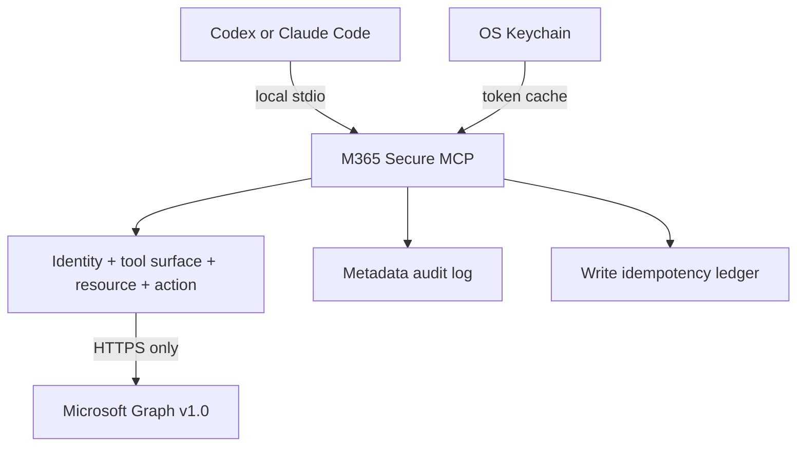

<p align="center">
  
</p>

[](https://github.com/bugroo/m365-secure-mcp/actions/workflows/ci.yml)
[](LICENSE)

A local-first MCP server that gives Codex, Claude Code, and compatible clients
controlled access to Microsoft 365 through fixed, reviewable tools.

| Fixed tools | Read profile | Opt-in writes | Delete tools | Modules |
|---:|---:|---:|---:|---:|
| 71 | 60 max | 11 | 0 | 20 |

[Installation](#installation) | [Security model](#security-model) |
[Capabilities](#capabilities) | [Tool catalog](docs/TOOL_CATALOG.md) |
[Entra setup](docs/ENTRA_SETUP.md)

## What this server is

`m365-secure-mcp` is not a generic Microsoft Graph proxy. The model cannot
choose a URL, HTTP method, permission scope, or request header.

The operator starts with a broad catalog, then reduces each deployment by
identity, module, tool, resource, and action. Unknown or out-of-policy
configuration fails before the server starts.



## Installation

Requirements: Python 3.11+, [`uv`](https://docs.astral.sh/uv/), and a
single-tenant Microsoft Entra public-client registration.

```bash
git clone https://github.com/bugroo/m365-secure-mcp.git
cd m365-secure-mcp
uv sync --frozen --python python3.13
```

The committed `uv.lock` pins the resolved dependency graph. This project has no
Node.js runtime, postinstall script, or client secret.

### Configure the smallest profile

```bash
export M365_TENANT_ID="<tenant-guid>"
export M365_CLIENT_ID="<public-application-guid>"
export M365_ALLOWED_USER_OBJECT_IDS="<user-object-guid>"
export M365_ALLOWED_UPN_DOMAINS="example.com"

uv run m365-secure-mcp --check-config
uv run m365-secure-mcp --list-tools
uv run m365-secure-mcp
```

The default configuration exposes only:

```text
m365_get_security_posture
m365_get_my_profile
```

Enable domains and individual tools deliberately:

```bash
export M365_MODULES="profile,mail,calendar,files"
export M365_ENABLED_TOOLS="m365_search_mail,m365_list_calendar,m365_search_files"
```

## Connect a client

<details>
<summary><strong>Codex</strong></summary>

Merge [examples/codex-read.toml](examples/codex-read.toml) into a trusted
project's `.codex/config.toml`, replace the placeholders, and keep:

```toml
default_tools_approval_mode = "prompt"
```

Do not combine a write profile with automatic tool approval.

</details>

<details>
<summary><strong>Claude Code</strong></summary>

Use [examples/claude-code-read.mcp.json](examples/claude-code-read.mcp.json) as
the local stdio definition. Keep tenant and user identifiers out of shared
repositories.

</details>

<details>
<summary><strong>Enterprise read profile</strong></summary>

[examples/enterprise-read.env.example](examples/enterprise-read.env.example)
contains every domain and resource boundary. Remove anything the deployment
does not need before granting Graph consent.

</details>

## Security model

| Boundary | Operator control | Enforced behavior |
|---|---|---|
| Identity | tenant, user object IDs, UPN domains | `/me` is verified before data access |
| Surface | modules, exact tool allowlist and denylist | unknown or unavailable names stop startup |
| Resources | sites, teams, chats, groups, plans | non-allowlisted identifiers are rejected locally |
| Writes | individual non-delete actions | separate process, two gates, approval, idempotency |
| Egress | Microsoft Graph target | HTTPS `graph.microsoft.com/v1.0` only |

Additional controls:

- delegated OAuth authorization code flow with PKCE
- OS Keychain token cache, with no plaintext token file
- Graph `v1.0` only, redirects disabled, bounded retries and responses
- signed pagination cursors bound to tool, principal, resource, and query
- M365 content treated as untrusted input and converted to bounded plain text
- separate read and write processes
- SQLite write reservation before Graph is called
- ETag concurrency on updates and per-tool rate limits
- metadata-only audit events with sensitive fields redacted

Read the complete threat model, assumptions, and residual risks in
[SECURITY.md](SECURITY.md).

## Capabilities

| Personal work | Collaboration | Content | Security and IT |
|---|---|---|---|
| Mail | Teams | OneDrive | Defender incidents |
| Calendar | Chats | SharePoint | Security alerts |
| Contacts | Channels | Excel structure | Entra audit |
| To Do | Groups | OneNote metadata | Intune |
| Planner | People and presence | Directory profiles | Service Health |

### Read profile

Up to **60 read tools** are selected by module and can be reduced to an exact
allowlist. Content-bearing responses are normalized, bounded, and marked as
untrusted external data.

### Write profile

The write process exposes **11 non-delete actions**, each separately enabled.
They cover mail drafts, calendar events, contacts, To Do tasks, Teams messages,
and Planner tasks. Exact tool contracts are listed in the
[tool catalog](docs/TOOL_CATALOG.md).

Every write requires a UUID idempotency key. The local ledger commits before
Graph is called. An uncertain result blocks automatic retry to avoid duplicate
external actions.

## Entra registration

Create a **single-tenant public desktop client**, add `http://localhost` as its
redirect URI, and grant only the delegated Graph permissions used by the
selected modules.

> [!IMPORTANT]
> Do not configure an `api://<guid>` scope for this local server. It requests
> Microsoft Graph scopes directly and does not require Expose an API, OBO,
> Dynamic Client Registration, or a client secret.

The full permission matrix and `Sites.Selected` instructions are in
[docs/ENTRA_SETUP.md](docs/ENTRA_SETUP.md).

### AADSTS500011

If Microsoft reports:

```text
The resource principal named api://<guid> was not found in the tenant
```

the client requested a token for a private API that is absent or unconsented in
that tenant. This server does not depend on that private resource principal.

Use the [authentication decision tree](docs/AUTH_TROUBLESHOOTING.md) to verify
the tenant, public-client ID, redirect URI, and delegated permissions.

## Configuration

```text
modules
  -> exact visible tool surface
     -> resource allowlists
        -> exact reachable data
```

Administrative domains such as Defender, Entra audit, Intune, and Service
Health also require:

```bash
export M365_PRIVILEGED_MODULES_ENABLED=true
```

See the [full configuration reference](docs/CONFIGURATION.md).

## Verification

```bash
uv run pytest -q
uv run ruff check .
uv run mypy src
uv run pip-audit
uv build
```

Current baseline:

| Check | Result |
|---|---|
| Tests | 40 passed |
| Ruff | clean |
| Mypy | strict, clean |
| Dependency audit | no known vulnerabilities |
| Package | wheel and source distribution |
| Full read-profile smoke test | exactly 60 tools |

Live Graph integration tests require a dedicated non-production tenant and
explicit operator consent.

## Documentation

| Document | Purpose |
|---|---|
| [Tool catalog](docs/TOOL_CATALOG.md) | All 71 contracts and their boundaries |
| [Security architecture](SECURITY.md) | Threat model, controls, residual risks |
| [Configuration](docs/CONFIGURATION.md) | Every environment variable and gate |
| [Entra setup](docs/ENTRA_SETUP.md) | Registration, delegated scopes, consent |
| [Authentication troubleshooting](docs/AUTH_TROUBLESHOOTING.md) | AADSTS diagnosis |
| [Reference review](docs/REFERENCE_REVIEW.md) | Comparative engineering decisions |

## Engineering references

The architecture was informed by, but does not import runtime code from:

- [`aixolotl/microsoft-planner-mcp`](https://github.com/aixolotl/microsoft-planner-mcp)
- [`Softeria/ms-365-mcp-server`](https://github.com/Softeria/ms-365-mcp-server)
- [`merill/lokka`](https://github.com/merill/lokka)

The adopted and rejected patterns are recorded in
[docs/REFERENCE_REVIEW.md](docs/REFERENCE_REVIEW.md).

## License

Apache License 2.0. See [LICENSE](LICENSE).
